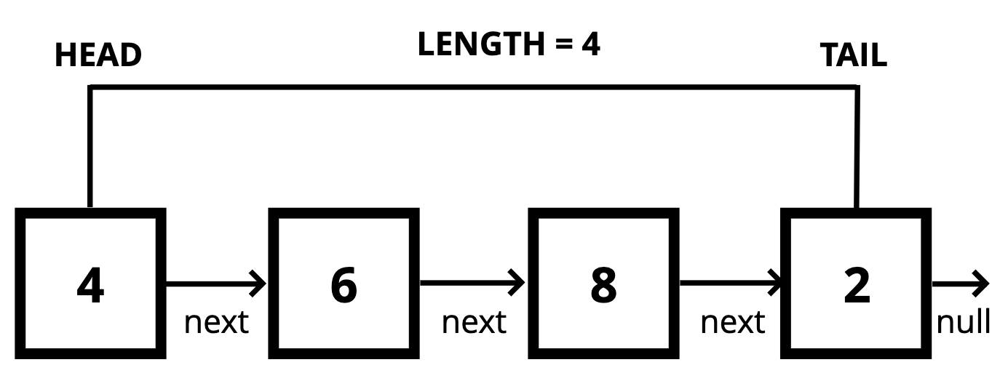

## Linked List

#### Definition

- a data structure that contains a `head`, `tail` and `length` property
- lined list consist of nodes
- each node has a `value` and a `pointer` to another node or null

  

#### Difference between `Lists` and `Arrays`\

|           | lists                                 | arrays                                      |
| --------- | ------------------------------------- | ------------------------------------------- |
| index     | don't have indexes                    | indexed in order                            |
| structure | connect via nodes with `next` pointer | insertion and deletion can be expensive     |
| access    | random is not allow                   | can quickly be accessed at a specific index |
